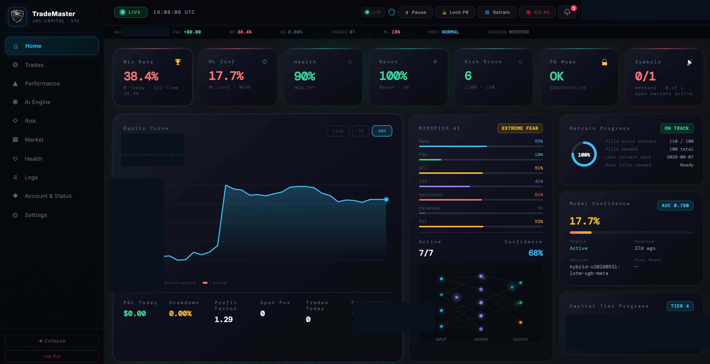

# The Analytics Dashboard

TradeMaster includes a custom-built, real-time analytics dashboard — a single-page application served directly from an embedded FastAPI server inside the trading engine. It is designed to give an at-a-glance, hedge-fund-grade view of the system's health and performance.

## Design Philosophy

The dashboard follows a **fintech-terminal aesthetic**: a dark palette, a cyan accent, semantic color (green/amber/red) for status, and **tabular-numeric typography** so figures align in columns and don't jitter as they update. The goal is a tool that looks and feels professional — calm, dense, and scannable.

## Features

### Home
- KPI tiles: win rate, ML confidence, system health, reconciliation status, risk score, mode, active symbols.
- Live equity curve with selectable time ranges.
- At-a-glance status with color-coded accents.

### Performance Page
A dedicated hub consolidating all performance analytics:
- Strategy-level and per-symbol performance breakdowns
- Performance calendar (P&L heat map)
- Time-of-day performance heatmap
- **Monte Carlo simulation** (1,000 forward paths × 30 days, with P10/P50/P90 outcome bands, probability of profit, and probability of ruin)
- Risk metrics: Sharpe, Sortino, VaR (95% / 99%), max drawdown, expectancy

### Risk & Health
- Daily-loss circuit-breaker status and profit-protection state
- Capital tier and position sizing
- System health: CPU, RAM, disk, component status, reconciliation confidence

### Engineering Details
- **Single self-contained HTML file** — no build step, no external dependencies, served inline.
- **CSS design-token system** (variables for the full palette, radii, typography).
- **Canvas-based charts** drawn from live data (equity curve, Monte Carlo fan chart, heatmaps).
- **Responsive mobile view** with a horizontally-scrollable bottom navigation and size-optimized cards.
- **Premium polish layer**: tabular numbers, value-change flash animations (green up / red down), skeleton loading states, and status-accent borders.
- Live updates on a polling cycle; automated daily email reports.

## Why Build It From Scratch

Off-the-shelf dashboards (Grafana, etc.) would have worked for raw metrics, but a bespoke SPA allowed:
- Domain-specific visualizations (Monte Carlo equity fans, R-multiple distributions, per-strategy attribution) that generic tools don't offer.
- A single-file, zero-dependency artifact that ships inside the engine with no extra infrastructure.
- Full control over the professional aesthetic.

### Screenshot

*Home page showing system health, ML confidence, risk score, and equity curve. Financial values redacted for privacy.*
